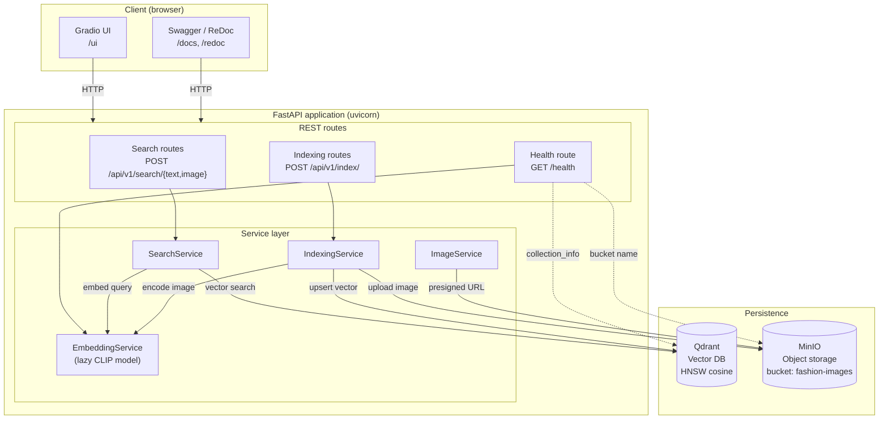

# Architecture

CLIP Image Retrieval is a single Python service that exposes a fine-tuned CLIP
model for fashion image search. It runs as a FastAPI application with a Gradio
UI mounted on top, and persists its state in two external services: Qdrant for
the vector index and MinIO for the image catalogue.

## High-level diagram

## Components

The application source lives entirely under `src/` with a flat package layout —
each subdirectory is an independently importable top-level package.

| Path | Responsibility |
|---|---|
| `src/config.py` | `Settings` (pydantic-settings) — CLIP / Qdrant / MinIO / API / legacy paths from env + `.env`. |
| `src/core/schemas.py` | Plain dataclasses passed between services: `SearchResult`, `ImageMeta`, `CollectionInfo`. |
| `src/core/embedding.py` | `EmbeddingService` — lazy-loaded CLIP model with `@torch.no_grad()` text / image feature extraction. |
| `src/core/search.py` | `SearchService` — coordinates `EmbeddingService` + `VectorStore`, validates input. |
| `src/core/indexing.py` | `IndexingService` — scans a directory, encodes images, uploads to MinIO, upserts into Qdrant. |
| `src/core/image_service.py` | `ImageService` — façade over `ObjectStore` returning presigned URLs and raw bytes. |
| `src/db/vector_store.py` | `VectorStore` — Qdrant client wrapper (3 modes: memory / local / remote), HNSW cosine collection. |
| `src/db/object_store.py` | `ObjectStore` — MinIO client wrapper scoped to a bucket. |
| `src/db/migration.py` | `MigrationService` — bulk migrate legacy `df.csv` + `df_image_embeds.npy` + `captions.json`. |
| `src/api/app.py` | `create_app()` FastAPI factory with CORS + 3 routers. |
| `src/api/dependencies.py` | `lru_cache`-backed DI container; FastAPI `Depends` targets. |
| `src/api/schemas.py` | Pydantic request / response models. |
| `src/api/routes/*` | `health.py`, `search.py` (`/api/v1/search/{text,image}`), `index.py` (`/api/v1/index/`). |
| `src/ui/gradio_app.py` | `build_ui(search_service, image_service)` — Gradio Blocks UI, mounted at `/ui`. |
| `src/server.py` | Entry point — wires services, mounts Gradio, starts uvicorn. Exposed as the `clip-retrieval` console script. |

### Service layer

Four service classes encapsulate the domain logic and are reused by both the
REST routes and the Gradio UI:

- **`EmbeddingService`** owns the CLIP model. Loading is *lazy* — the model
  files are downloaded and moved to GPU/CPU only on the first call to
  `get_text_features` / `get_image_features`. This keeps process startup cheap
  and lets the `/health` endpoint report `model_loaded=false` until real
  traffic arrives.
- **`SearchService`** is the orchestrator for read traffic: validate input →
  embed → query Qdrant → return `list[SearchResult]`.
- **`IndexingService`** is the orchestrator for write traffic: walk a
  directory, encode each image, upload it to MinIO, then upsert all vectors
  into Qdrant in a single batched call.
- **`ImageService`** is a thin façade over `ObjectStore` so that routes and the
  UI don't have to know about MinIO specifics — they ask for a URL and get a
  presigned URL.

### Storage layer

- **`VectorStore`** (Qdrant) creates the collection with `Distance.COSINE`,
  `VectorParams(size=512)` and `HnswConfigDiff(m=32, ef_construct=200)`. Point
  ids are `uuid5(NAMESPACE_URL, object_key)` so upserts are idempotent — the
  same `image_path` always maps to the same point. Queries use `query_points`
  with `SearchParams(hnsw_ef=128)`. Three modes are supported via
  `QDRANT_MODE`:
  - `memory`: pure in-process, great for tests.
  - `local`: file-backed at `QDRANT_PATH`.
  - `remote`: HTTP client against `QDRANT_URL` (+ optional `QDRANT_API_KEY`).
- **`ObjectStore`** (MinIO) auto-creates the bucket on init, exposes
  `upload_file` / `upload_bytes`, returns `presigned_get_object` URLs via
  `datetime.timedelta`, and explicitly closes + releases HTTP connections in
  `get_object`.

### API layer

- **`create_app()`** builds the FastAPI app with permissive CORS and three
  routers.
- **`dependencies.py`** uses `@lru_cache(maxsize=1)` to make every service a
  process-wide singleton. The functions are wired into FastAPI via `Depends`,
  which means tests can swap any service via `app.dependency_overrides[...]`.
- **Routes**:
  - `POST /api/v1/search/text` — Pydantic body `TextSearchRequest`, returns
    `SearchResponse` with presigned MinIO URLs.
  - `POST /api/v1/search/image` — multipart `UploadFile` + `?top_k=N`, decodes
    via PIL.
  - `POST /api/v1/index/` — optional `images_dir`, falls back to
    `LEGACY_IMAGES_PATH`.
  - `GET /health` — reports model load status, Qdrant collection info, and the
    active MinIO bucket.

### UI layer

`ui/gradio_app.py::build_ui(search_service, image_service)` constructs a
Gradio `Blocks` UI bound to the two services. It is mounted on top of the
FastAPI app at `/ui` via `gr.mount_gradio_app`, so the entire system is served
by a single uvicorn process.

The UI exposes:

- A radio toggle Text / Image,
- A Top-K slider (1–50),
- A text input *or* image uploader,
- A gallery rendering presigned MinIO URLs,
- An "on select" handler that reveals the score + caption of the chosen
  result.

## Deployment

`docker-compose.yml` brings up three services on a single Compose network:

| Service | Image | Ports | Volume |
|---|---|---|---|
| `qdrant` | `qdrant/qdrant:v1.12.1` | `6333` (REST), `6334` (gRPC) | `qdrant_data` |
| `minio` | `minio/minio:latest` | `9000` (API), `9001` (Console UI) | `minio_data` |
| `app` | Built from `Dockerfile` | `8000` (FastAPI + Gradio) | — |

Inside the network the `app` service reaches Qdrant at `http://qdrant:6333`
and MinIO at `minio:9000`. The Dockerfile installs dependencies with
[`uv`](https://docs.astral.sh/uv/) using `uv sync --frozen --no-dev` against
`uv.lock` for deterministic builds, and ships a virtual environment at
`/opt/venv` so the `clip-retrieval` console script is on `PATH`.

## Configuration

All settings are derived from environment variables (and optionally a local
`.env`). See `Settings` in `src/config.py` for the full list and defaults, and
[`.env.example`](../.env.example) for a copy-paste template.

## Testing

The test suite under `tests/` runs against:

- Qdrant in **memory mode** — no external service required.
- A `MagicMock` `ObjectStore` returning deterministic presigned URLs.
- A deterministic embedding service that derives 512-d vectors from input
  hashes, so retrieval results are stable across runs.
- FastAPI's `TestClient` with `app.dependency_overrides` injecting the fakes.

The full suite finishes in ~3 seconds.
