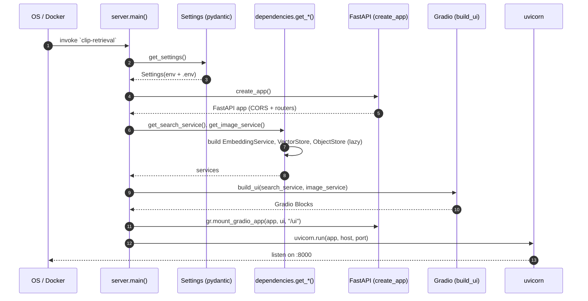
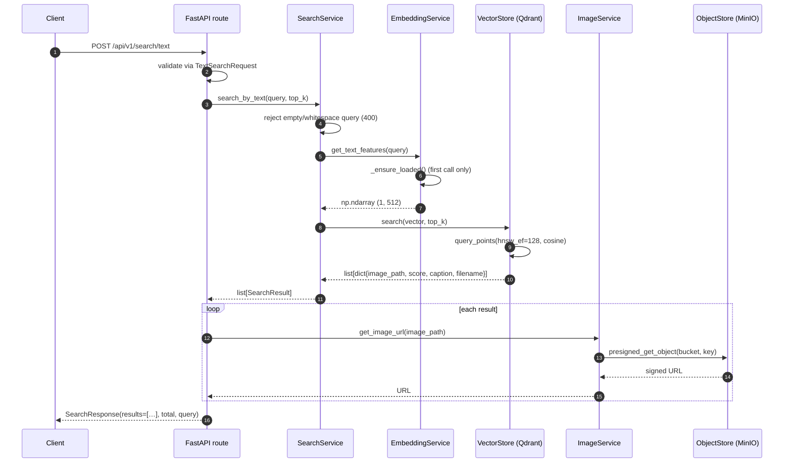
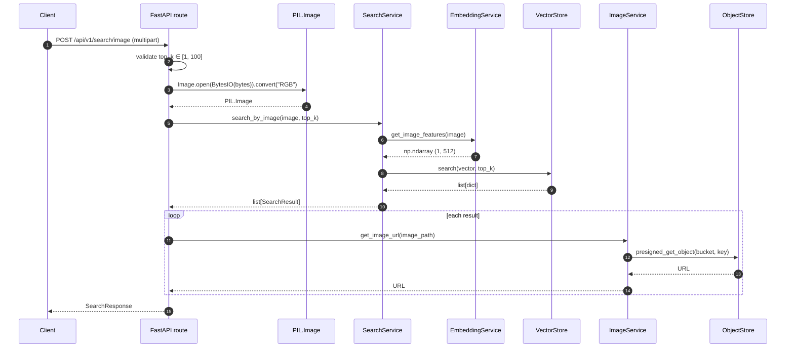
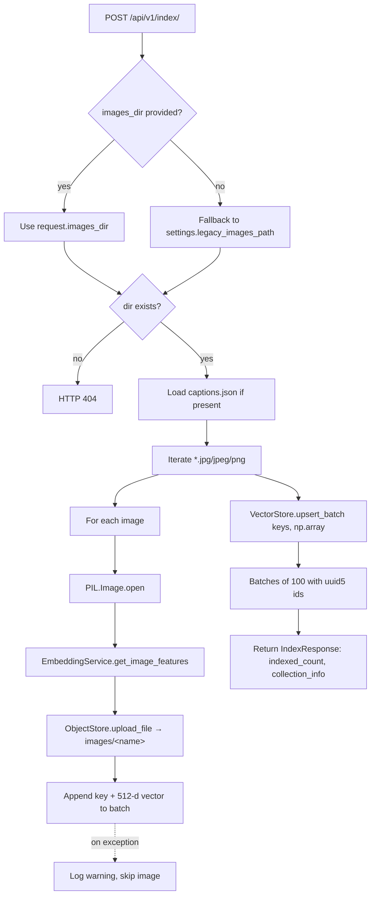
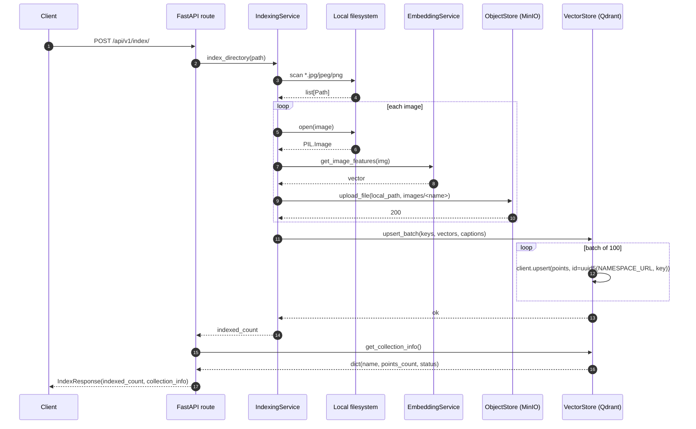
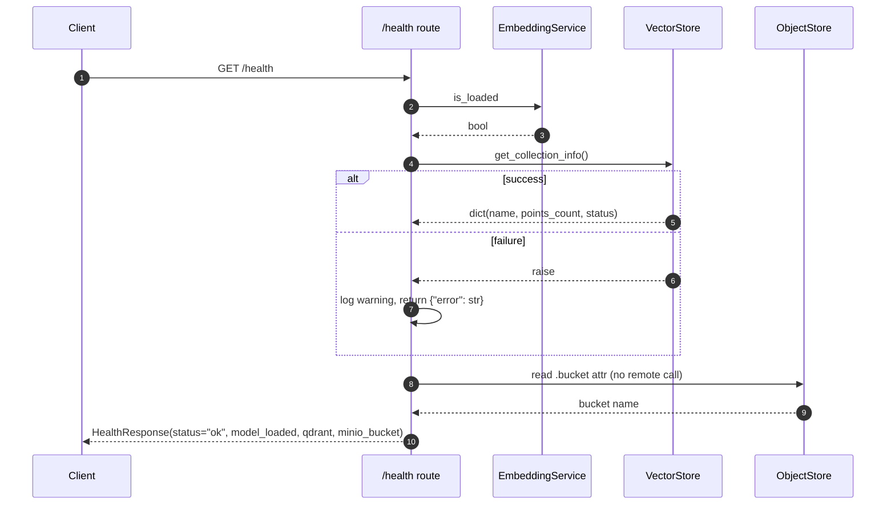
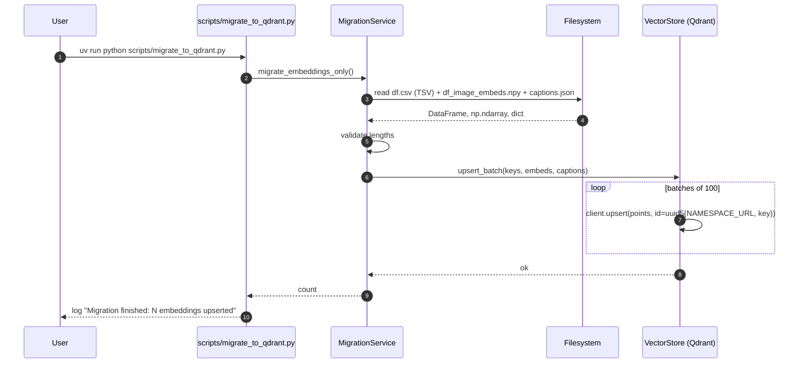
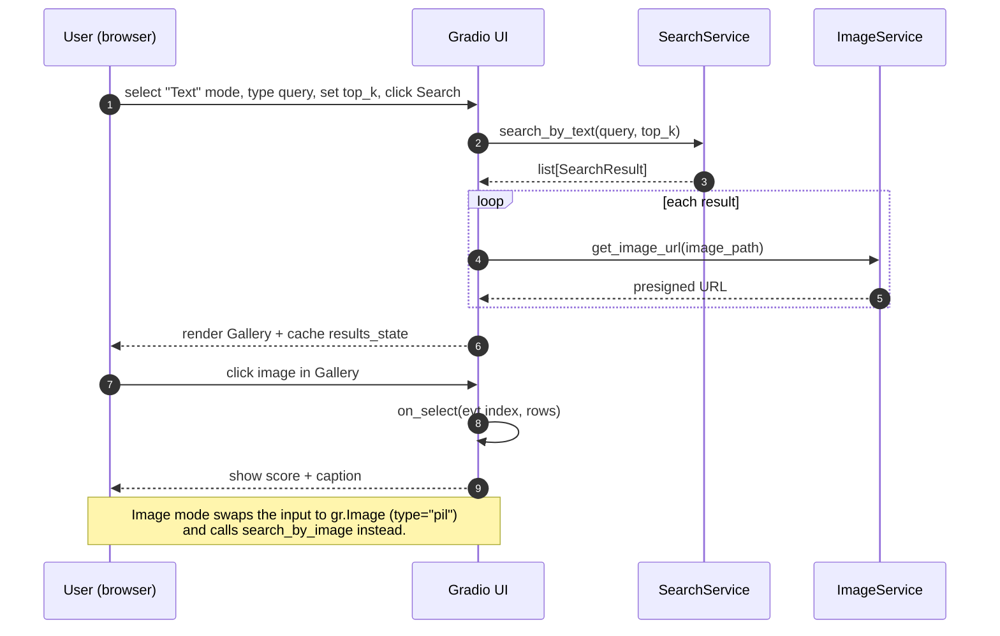

# Data flows

This document shows every end-to-end data path through the service using
Mermaid sequence and flow diagrams. They cover:

1. [Process startup & dependency wiring](#1-process-startup--dependency-wiring)
2. [Text search](#2-text-search)
3. [Image search](#3-image-search)
4. [Indexing a directory](#4-indexing-a-directory)
5. [Health probe](#5-health-probe)
6. [Migration from legacy artefacts](#6-migration-from-legacy-artefacts)
7. [Gradio UI interactions](#7-gradio-ui-interactions)
8. [Storage shape](#8-storage-shape)

---

## 1) Process startup & dependency wiring



Notes:

- `@lru_cache(maxsize=1)` on every `get_*` factory makes each service a
  process-wide singleton.
- `EmbeddingService` does **not** load the CLIP model here — it waits until
  the first call to `get_text_features` / `get_image_features`.

---

## 2) Text search

`POST /api/v1/search/text` with `{ "query": "...", "top_k": N }`.



---

## 3) Image search

`POST /api/v1/search/image` with multipart `file` + query param `top_k`.



---

## 4) Indexing a directory

`POST /api/v1/index/` with `{ "images_dir": "/path" }` (optional — falls back
to `LEGACY_IMAGES_PATH`).



The detailed sequence between services:



---

## 5) Health probe

`GET /health` — used by load balancers, Docker, and humans.



---

## 6) Migration from legacy artefacts

For users coming from a pre-computed `df.csv` + `df_image_embeds.npy`
checkpoint plus a local `images/` directory.

```mermaid
flowchart TD
    A[scripts/upload_images_to_minio.py] --> B[MigrationService.upload_images]
    B --> C[Iterate images/*.jpg]
    C --> D{object_exists in MinIO?}
    D -- yes --> E[Skip]
    D -- no --> F[ObjectStore.upload_file]
    F --> G[Bump uploaded counter]

    H[scripts/migrate_to_qdrant.py] --> I[MigrationService.migrate_embeddings_only]
    I --> J[Read df.csv TSV → image_path column]
    I --> K[Load df_image_embeds.npy]
    I --> L{len(df) == len(embeds)?}
    L -- no --> M[raise ValueError]
    L -- yes --> N[Read captions.json if present]
    N --> O[VectorStore.upsert_batch keys, embeds, captions]

    P[MigrationService.migrate_all] --> B
    P --> I
```



---

## 7) Gradio UI interactions

The UI is mounted at `/ui` and shares the *same* singleton services as the
REST API.



---

## 8) Storage shape

How a single fashion image lives across the two storage backends.

```mermaid
flowchart LR
    subgraph LocalFS["Local FS (only during indexing)"]
        IMG[/dress_001.jpg/]
    end
    subgraph MinIO["MinIO bucket: fashion-images"]
        OBJ["object: images/dress_001.jpg"]
    end
    subgraph Qdrant["Qdrant collection: fashion_images"]
        POINT["point id = uuid5(NAMESPACE_URL,<br/>'images/dress_001.jpg')<br/>vector: 512-d<br/>payload: {image_path, caption, filename}"]
    end

    IMG -->|CLIP encode| VEC[(512-d vector)]
    IMG -->|ObjectStore.upload_file| OBJ
    VEC -->|VectorStore.upsert_batch| POINT
    POINT -. payload.image_path .-> OBJ
    OBJ -->|presigned URL| Client[(Client browser)]
```

Notes:

- `image_path` is the Qdrant payload field that ties a vector hit back to its
  MinIO object key.
- Because the point id is derived from `uuid5(NAMESPACE_URL, image_path)`,
  re-indexing the same image is idempotent — the existing point is overwritten
  rather than duplicated.
